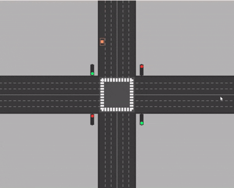
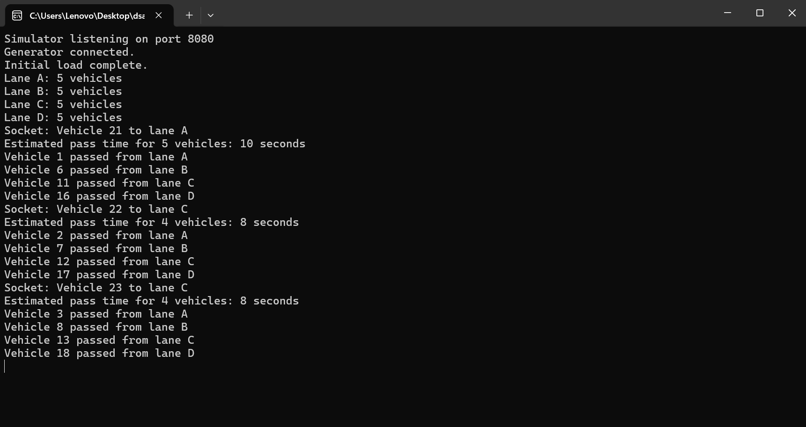

# DSA Queue Simulator - Traffic Light Management System



## Project Overview
A comprehensive traffic junction simulator implementing queue data structures for vehicle management. Features priority lane handling, traffic light cycles, inter-process communication, and optional graphics visualization. Developed for COMP202 DSA assignment.

## Features
- **Queue-Based Management**: FIFO queues for each lane using linked lists (O(1) enqueue/dequeue)
- **Priority Lane Handling**: AL2 (lane A) gets priority when >10 vehicles accumulate, serving until <5
- **Traffic Light Simulation**: RED/GREEN cycles (10s green, 5s red) with serving only during green
- **Communication**: Socket-based IPC between generator and simulator (TCP on port 8080)
- **Graphics**: SDL2-based visual rendering of lanes, lights, and vehicles
- **Logging & Testing**: File-based simulation logs and unit/integration tests
- **Multiple Generators**: Basic, burst, and steady traffic patterns
- **Monitoring**: Real-time queue status via receiver programs

## Design Decisions

- **Lane Configuration (6 Lanes per Road):**
   - The assignment specifies 3 lanes per road (1 incoming, 2 outgoing), but we implemented 3 lanes per direction (totaling 6 per road) for enhanced realism and safety.
   - **Why?**
      - Prevents head-on collisions by separating incoming and outgoing traffic.
      - Allows for dedicated left-turn, straight, and right-turn lanes, matching real-world intersections.
      - Each lane has a specific turning intent, making the simulation more accurate and visually clear.
      - Enables more realistic traffic light logic: with 6 lanes (3 per direction), each axis (NS/EW) can have its own green light at the same time, just like real intersections. This is why you see two green lights in the simulation—one for each direction. If we used only 3 lanes per road, this would not be possible, and only one side could go at a time.
      - The design allows for more granular control and better visualization of traffic flow, lane priorities, and turning behaviors.
   - **Assignment Compatibility:**
      - The priority and normal lane logic (e.g., AL2 as priority) is still fully supported, just mapped to the more detailed lane structure.
      - The extra lanes do not change the core queue management or priority logic—they only improve safety and realism in the simulation.
   - **Summary:**
      - This design choice was made to provide a more accurate, safe, and visually informative simulation, while still meeting all assignment requirements for queue management and priority handling.

## Project Structure
```
dsa-simulator/
├── src/
│   ├── queue.c/.h          # Core queue implementation
│   ├── simulator.c         # Main simulator with traffic logic
│   ├── traffic_generator.c # Basic vehicle generator
│   ├── traffic_generator2.c # Burst mode generator
│   ├── traffic_generator3.c # Steady mode generator
│   ├── reciever.c          # Basic queue monitor
│   ├── reciever2.c         # Logging monitor
│   ├── graphics.c          # SDL visualization
│   ├── test_*.c            # Unit and integration tests
├── docs/
│   └── report.md           # Detailed project report
├── data/
│   └── lane*.txt           # Lane data files
├── screenshots/            # Demo images
├── videos/                 # Demo videos
├── Makefile                # Build script
├── demo.sh                 # Demo runner
├── README.md               # This file
└── LICENSE                 # MIT License
```

## Dependencies
- **C Compiler**: GCC 4.8+ or compatible (MinGW on Windows)
- **Libraries**: 
  - Windows: ws2_32 (for Winsock sockets)
  - Optional: SDL2 2.0+ (for graphics)
- **Tools**: Make (optional, manual compilation possible)

## How to Run

### Prerequisites
- Install GCC (e.g., via MinGW-w64 on Windows, apt on Ubuntu)
- For graphics: Install SDL2 dev libraries (`sudo apt install libsdl2-dev` on Linux)

### Build
```bash
# Automatic (requires make)
make

# Manual compilation
gcc -I src -Wall -Wextra -o simulator src/simulator.c src/queue.c -lws2_32
gcc -I src -Wall -Wextra -o traffic_generator src/traffic_generator.c -lws2_32
gcc -I src -Wall -Wextra -o test_queue src/test_queue.c src/queue.c
gcc -I src -Wall -Wextra -o test_integration src/test_integration.c src/queue.c
gcc -I src -Wall -Wextra -o reciever src/reciever.c
gcc -I src -Wall -Wextra -o reciever2 src/reciever2.c
gcc -I src -Wall -Wextra -o traffic_generator2 src/traffic_generator2.c
gcc -I src -Wall -Wextra -o traffic_generator3 src/traffic_generator3.c
# Graphics (if SDL installed)
gcc -I src -I/usr/include/SDL2 -Wall -Wextra -o graphics src/graphics.c -lSDL2
```

### Run Basic Simulation
1. **Terminal 1**: Start simulator server
   ```bash
   ./simulator
   ```
   Output: "Simulator listening on port 8080"

2. **Terminal 2**: Start traffic generator
   ```bash
   ./traffic_generator
   ```
   Output: "Connected to simulator." then vehicle additions

3. **Watch Terminal 1**: Vehicle processing, light changes, queue updates every 5s

### Advanced Usage
- **Multiple Generators**: `./traffic_generator & ./traffic_generator2 & ./traffic_generator3 &`
- **Monitoring**: `./reciever` (console) or `./reciever2` (logs to file)
- **Testing**: `./test_queue && ./test_integration`
- **Graphics**: `./graphics` (if compiled)
- **Logs**: `cat simulation_log.txt`
- **Demo**: `./demo.sh` (Linux/Mac)

### Expected Behavior
- Vehicles added to lanes, processed proportionally during green light
- Priority activates for lane A when >10 vehicles
- Light cycles: GREEN (serve) → RED (wait) → GREEN
- Real-time queue size updates

## Troubleshooting
- **Compilation Errors**: Ensure GCC and ws2_32.lib are linked
- **Socket Connection Failed**: Check firewall, use localhost (127.0.0.1)
- **Graphics Not Working**: Install SDL2, verify include paths
- **Windows Sleep Issues**: Ensure windows.h is included
- **Port Conflicts**: Change port in code if 8080 is busy

## Author
Sujan Bhatta - Roll No. 14 (CS II/I)

## Status
✅ Completed - Ready for submission

## Media

- **Simulator Console Screenshot**:

   

## References
- Assignment: COMP202 DSA Queue Simulator
- SDL Documentation: https://wiki.libsdl.org/SDL2/FrontPage
- C Programming: Kernighan & Ritchie
- GitHub Repository: https://github.com/sujan0629/dsa-queue-simulator

## Cross-Platform
- Linux/Mac: Install SDL2 via package manager
- Windows: Use MinGW, link ws2_32 for sockets